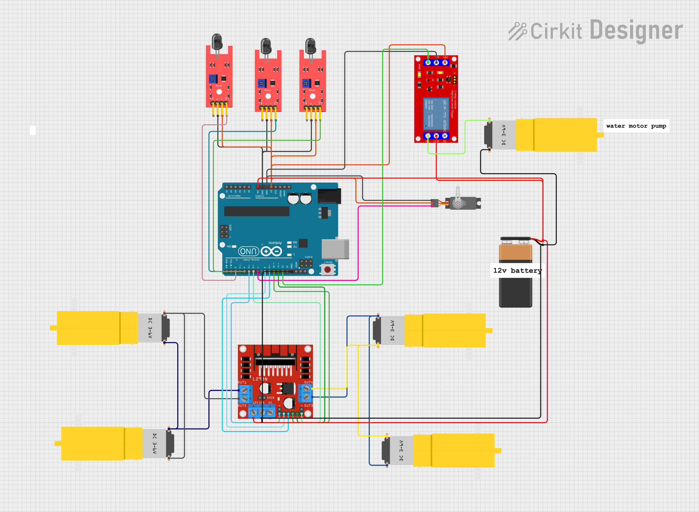

# Autonomous Fire Fighting Robot

An Arduino-based autonomous fire-fighting robot designed to detect a flame, navigate toward the fire source, and activate a water pump for fire suppression. The project demonstrates **embedded programming, sensor interfacing, motor control, real-time decision making, and actuator control**.



## Overview

The Autonomous Fire Fighting Robot is an embedded systems project developed using the **Arduino Uno**.

The robot continuously monitors its surroundings using **flame sensors**. When a flame is detected, the Arduino processes the sensor inputs and controls the DC motors to move the robot toward the detected fire source. Once the robot reaches the fire, a **water pump is activated** to suppress the flame.

The project demonstrates the integration of sensors, motor drivers, actuators, and embedded control logic into a single autonomous robotic system.

## Features

* Automatic flame detection
* Autonomous movement toward the detected fire source
* Real-time flame sensor monitoring
* DC motor control using L298N motor driver
* Automatic water pump activation
* Embedded control using Arduino Uno
* Sensor-based decision making
* Actuator control for fire suppression

## Hardware Components

* Arduino Uno
* Flame Sensors
* L298N Motor Driver
* DC Motors
* Water Pump
* Relay Module
* Robot Chassis
* Battery Pack
* Connecting Wires

## Software / Tools

* **Programming Language:** Arduino C/C++
* **IDE:** Arduino IDE
* **Microcontroller:** Arduino Uno

## How It Works

The robot operates based on the input received from the flame sensors.

1. Flame sensors continuously monitor the surroundings for a fire source.
2. The Arduino Uno reads and processes the sensor inputs.
3. Based on the sensor readings, the Arduino determines the required motor movement.
4. The L298N motor driver controls the DC motors for robot movement.
5. The robot moves toward the detected fire source.
6. When the fire source is detected at the required position, the Arduino activates the water pump.
7. The water pump sprays water toward the fire to suppress it.

### System Flow

```text
       Flame Sensors
             |
             v
      +--------------+
      |  Arduino Uno |
      | Control Logic|
      +--------------+
          |       |
          |       |
          v       v
    L298N Motor   Relay
      Driver       |
          |        v
          v    Water Pump
      DC Motors     |
          |         |
          v         v
       Robot    Fire Suppression
      Movement
Embedded Systems Concepts Demonstrated
Embedded C/C++ programming
Arduino microcontroller programming
GPIO configuration
Digital sensor interfacing
Flame sensor interfacing
Motor driver control
DC motor control
Relay control
Actuator interfacing
Real-time sensor monitoring
Conditional control logic
Autonomous robotic control
Sensor-based decision making
Hardware-software integration
Project Workflow
Start
  |
  v
Initialize Arduino
  |
  v
Read Flame Sensors
  |
  v
Flame Detected?
  |
  +------ No ------> Continue Monitoring
  |
 Yes
  |
  v
Determine Movement
  |
  v
Control DC Motors
  |
  v
Move Toward Fire
  |
  v
Activate Water Pump
  |
  v
Suppress Fire
  |
  v
Continue Monitoring
Project Structure
Autonomous-Firefighting-Robot/
│
├── README.md
├── firefighting_robot.ino
└── circuit_image.png
Circuit Diagram

The following image shows the hardware circuit used for the project.

How to Run
Install Arduino IDE.
Open firefighting_robot.ino.
Connect the Arduino Uno to the computer.
Select the appropriate Arduino board and COM port.
Compile and upload the program to the Arduino Uno.
Assemble the robot according to the circuit diagram.
Power the robot using the appropriate battery supply.
Place a controlled flame source within the robot's detection range.
The robot detects the flame, moves toward it, and activates the water pump for fire suppression.

Safety: Test the fire-detection and water-pump system in a controlled environment with appropriate safety precautions.

Future Improvements
Obstacle avoidance using ultrasonic sensors
Servo-based water nozzle positioning
Wireless monitoring and control
Smoke and temperature sensing
IoT-based fire alerts
Mobile application for remote monitoring
Improved fire localization using multiple sensors
Author

Abhishek Biradar

B.E. Electronics & Communication Engineering

Embedded Systems | Firmware Development | Robotics | IoT
